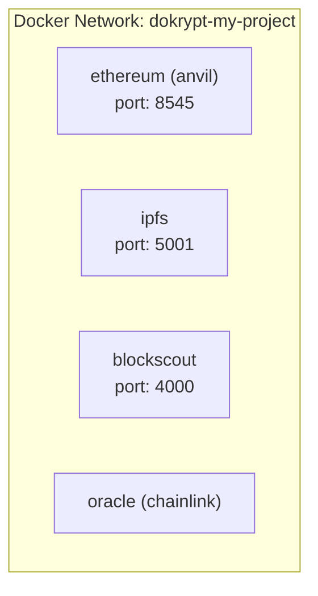

## Overview

Dokrypt orchestrates Docker containers for every chain and service. Understanding the container architecture helps with debugging, customization, and advanced configurations.

## Container Architecture

When you run `dokrypt up`, Dokrypt:

1. **Creates a Docker network** — `dokrypt-{project-name}` for inter-container communication
2. **Starts chain containers** — Each chain runs in its own container (Anvil, Hardhat, or Geth)
3. **Starts service containers** — IPFS, explorers, oracles, etc. in dependency order
4. **Runs health checks** — Waits for all containers to report healthy
5. **Saves state** — Container IDs and ports saved to `~/.dokrypt/state/`



## Container Runtime

Dokrypt supports Docker and Podman:

```yaml
# dokrypt.yaml
settings:
  runtime: docker    # or podman
```

Or via CLI:

```bash
dokrypt up --runtime podman
```

### Runtime Requirements

| Runtime | Minimum Version | API Version |
|---------|----------------|-------------|
| Docker | 20.10+ | 1.41+ |
| Podman | 4.0+ | — |

## Docker Images

### Chain Images

| Engine | Image |
|--------|-------|
| Anvil | `ghcr.io/foundry-rs/foundry:latest` |
| Hardhat | `node:20-alpine` (runs npx hardhat) |
| Geth | `ethereum/client-go:stable` |

### Service Images

| Service | Image |
|---------|-------|
| IPFS | `ipfs/kubo:latest` |
| Blockscout | `blockscout/blockscout:latest` |
| Subgraph | `graphprotocol/graph-node:latest` |

## Running Dokrypt in Docker

Dokrypt itself can run as a Docker container:

```bash
docker pull ghcr.io/dokrypt/dokrypt:latest
```

```bash
docker run --rm \
  -v /var/run/docker.sock:/var/run/docker.sock \
  -v $(pwd):/workspace \
  -w /workspace \
  ghcr.io/dokrypt/dokrypt:latest up
```

The Docker socket mount is required so Dokrypt can manage sibling containers.

### Dockerfile.cli

```dockerfile
FROM golang:1.24-alpine AS builder
WORKDIR /build
COPY go.mod go.sum ./
RUN go mod download
COPY . .
RUN CGO_ENABLED=0 GOOS=linux go build -ldflags="-s -w" -o /dokrypt ./cmd/dokrypt

FROM alpine:3.20
RUN apk add --no-cache ca-certificates docker-cli
COPY --from=builder /dokrypt /usr/local/bin/dokrypt
ENTRYPOINT ["dokrypt"]
```

## Custom Service Images

Use `type: custom` to run any Docker image:

```yaml
services:
  my-api:
    type: custom
    image: my-api:latest
    ports:
      http: 3000
    environment:
      DATABASE_URL: "postgres://db:5432/mydb"
```

### Build from Dockerfile

```yaml
services:
  my-service:
    type: custom
    build:
      context: ./my-service
      dockerfile: Dockerfile
    ports:
      http: 8080
```

## Container Labels

Dokrypt labels all containers with:

```
dokrypt.project=my-project
dokrypt.service=ethereum
dokrypt.type=chain
```

You can list Dokrypt containers:

```bash
docker ps --filter "label=dokrypt.project=my-project"
```

## Networking

### Environment Network

All containers share a Docker bridge network named `dokrypt-{project}`. Containers can reach each other by service name:

```
http://ethereum:8545     # Chain RPC (from inside containers)
http://ipfs:5001         # IPFS API (from inside containers)
```

From the host, use `localhost` with the mapped ports:

```
http://localhost:8545     # Chain RPC (from host)
http://localhost:5001     # IPFS API (from host)
```

## Volumes

Services can mount volumes for persistent data:

```yaml
services:
  my-service:
    type: custom
    volumes:
      - "./data:/app/data"        # Bind mount
      - "my-volume:/app/storage"  # Named volume
```

Remove volumes when stopping:

```bash
dokrypt down --volumes
```

## Debugging Containers

### View logs

```bash
dokrypt logs -f -s ethereum
```

### Execute commands inside a container

```bash
dokrypt exec ethereum sh
dokrypt exec ipfs ipfs id
```

### Inspect container directly with Docker

```bash
docker inspect $(docker ps -q --filter "label=dokrypt.service=ethereum")
```

## Resource Limits

Container resource limits can be set through the container runtime configuration. The `ContainerConfig` supports:

| Setting | Description |
|---------|-------------|
| `MemoryLimit` | Maximum memory (e.g., `512m`, `2g`) |
| `CPULimit` | CPU cores (e.g., `1.5` = 1.5 cores) |
| `ReadOnly` | Read-only root filesystem |
| `CapDrop` | Dropped Linux capabilities |

These are configured programmatically through the container runtime interface and can be set via custom service configurations.

## Cleanup

```bash
# Stop everything
dokrypt down

# Stop and remove volumes
dokrypt down --volumes

# Manual cleanup if needed
docker rm -f $(docker ps -aq --filter "label=dokrypt.project=my-project")
docker network rm dokrypt-my-project
```
